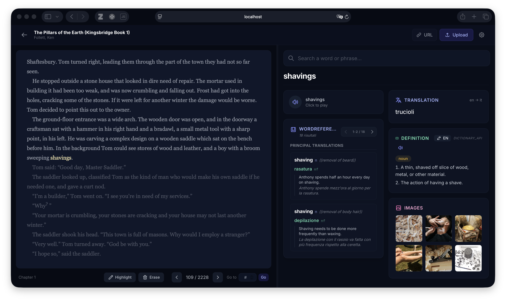

# 📖 Tradictionary

A containerized language learning platform that combines an EPUB/PDF reader with instant translation, dictionary, pronunciation, and image search — all in one sidebar. No API keys required.

> **Stop tab-switching between WordReference, Cambridge, and Google Images.**
> Open your book, select a word, get everything you need without leaving the page.



---

## Quick Start

### Prerequisites

- [Docker](https://docs.docker.com/get-docker/) & [Docker Compose](https://docs.docker.com/compose/install/) v2+

### Launch

```bash
docker compose up --build
```

Then open **http://localhost:5173** — upload an EPUB or PDF and start reading.

That's it. No API keys, no model downloads, no configuration needed.

---

## What It Does

Select any word or phrase while reading and the sidebar instantly shows:

| Module | Source | What you get |
|--------|--------|-------------|
| 🌐 **WordReference** | wordreference.com (scraped) | Bilingual translations with categories, contexts, and example sentences |
| 🔄 **Translation** | Google Translate | Quick single-word or phrase translation |
| 📖 **Definition** | Free Dictionary API / Wiktionary | Monolingual definitions with part-of-speech |
| 🔊 **Pronunciation** | Microsoft Edge TTS | Audio playback in 40+ languages |
| 🖼️ **Images** | DuckDuckGo / Wikimedia | Visual context for the word |

All modules run in parallel — results appear progressively as each source responds.

---

## Features

### Reader
- 📖 **EPUB & PDF support** — Dark-mode styled reader with Epub.js and react-pdf
- 🎯 **Reading Mode** — Text you've read stays bright, unread text is faded; the boundary follows your cursor word by word (CSS Custom Highlight API)
- 📌 **Reading Checkpoint** — Click to save your position (survives page reloads), click again to resume
- 🔄 **Exact Position Restore** — Books reopen on the precise page you left, via saved screen-start CFIs
- ⚡ **Fast Book Opening** — Per-book location caching: the full-book parse happens once, later opens are near-instant
- 🖍️ **Highlighter** — Persistent text highlights with an eraser tool
- 📚 **Library** — Upload, manage, and switch between EPUBs and PDFs (URL import supported)

### Search & Lookup
- 🔍 **Unified Search** — Type in the sidebar or select text in the reader for instant results
- 🌐 **WordReference** — Full bilingual dictionary with paginated results, scraped in real time
- 🔄 **Translation** — Google Translate via deep-translator, with Ollama as optional upgrade
- 📖 **Definitions** — Free Dictionary API and Italian Wiktionary parsing
- 🖼️ **Images** — DuckDuckGo image search + Wikimedia Commons (no API key)
- 🔊 **Audio** — Microsoft Edge TTS for pronunciation

### UX
- ⚙️ **16 languages** supported, with quick language swap
- ⌨️ **Keyboard navigation** — Arrow keys for pages and WordReference pagination
- 🌑 **Dark mode** — Full dark theme throughout

### Reading Mode

| Action | Effect |
|--------|--------|
| Move the cursor | Read/unread boundary follows the word under the cursor |
| Single click | Saves checkpoint and pauses |
| Single click while paused | Resumes from the cursor |
| Select text | Looks up the selection in the sidebar |
| Escape | Deselects and returns to reading |

---

## Architecture

```
┌─────────────┐     ┌──────────────────┐     ┌────────────────────────┐
│   Browser    │────▶│  Frontend (5173) │────▶│   Backend (8000)       │
│              │     │  React + Vite    │     │   FastAPI              │
└─────────────┘     └──────────────────┘     │                        │
                                              │  ├─ Google Translate   │
                                              │  ├─ WordReference      │
                                              │  ├─ Free Dictionary    │
                                              │  ├─ DuckDuckGo Images  │
                                              │  ├─ Wikimedia Commons  │
                                              │  ├─ Edge TTS           │
                                              │  └─ (Ollama, optional) │
                                              └────────────────────────┘
```

| Service | Port | Stack |
|---------|------|-------|
| **frontend** | 5173 | React 18, Vite, Epub.js, react-pdf, Tailwind CSS |
| **backend** | 8000 | FastAPI, httpx, BeautifulSoup, deep-translator, edge-tts |
| **ollama** *(optional)* | 11434 | LLM inference — only if `ENABLE_OLLAMA=true` |

---

## Optional: AI-Powered Translation with Ollama

The platform works fully without any AI/LLM. However, you can optionally enable [Ollama](https://ollama.com/) for richer, context-aware translations:

```bash
# Start with Ollama enabled
ENABLE_OLLAMA=true docker compose --profile ollama up --build
```

When enabled, translation uses Llama 3.2 via Ollama instead of Google Translate, providing contextual examples alongside the translation.

---

## Project Structure

```
tradictionary/
├── docker-compose.yml
├── backend/
│   ├── Dockerfile
│   ├── requirements.txt
│   └── app/
│       ├── main.py                  # FastAPI entrypoint + unified search
│       ├── config.py                # Environment-based settings
│       ├── models/schemas.py        # Pydantic models
│       ├── routers/                 # API route handlers
│       │   ├── translate.py
│       │   ├── define.py
│       │   ├── wordreference.py
│       │   ├── images.py
│       │   ├── tts.py
│       │   ├── epub.py
│       │   └── pdf.py
│       └── services/               # Business logic
│           ├── translator.py        # Google Translate / Ollama
│           ├── wordreference.py     # WR scraper with retry
│           ├── dictionary.py        # Free Dictionary API
│           ├── it_wiktionary.py     # Italian Wiktionary parser
│           ├── image_search.py      # DuckDuckGo + Wikimedia
│           ├── tts_engine.py        # Edge TTS
│           ├── epub_manager.py      # EPUB storage & parsing
│           ├── pdf_manager.py       # PDF storage & cover extraction
│           └── ollama_client.py     # Ollama integration (optional)
├── frontend/
│   ├── Dockerfile
│   ├── package.json
│   └── src/
│       ├── App.tsx                  # Main layout + settings
│       ├── components/
│       │   ├── EpubReader.tsx       # EPUB renderer + Reading Mode
│       │   ├── PdfReader.tsx        # PDF renderer
│       │   ├── SearchSidebar.tsx    # Unified search sidebar
│       │   ├── WordReferenceCard.tsx # Paginated WR results
│       │   ├── TranslationCard.tsx
│       │   ├── DefinitionCard.tsx
│       │   ├── ImageGrid.tsx
│       │   └── AudioPlayer.tsx
│       ├── hooks/
│       │   ├── useSearch.ts         # Progressive parallel search
│       │   └── useEpub.ts           # Library management
│       └── services/api.ts          # Backend API client
└── scripts/
    └── init-model.sh
```

## API

| Method | Endpoint | Description |
|--------|----------|-------------|
| `POST` | `/api/search` | Unified search (all modules in parallel) |
| `POST` | `/api/translate` | Translation (Google Translate or Ollama) |
| `POST` | `/api/define` | Dictionary definition lookup |
| `POST` | `/api/wordreference` | WordReference bilingual dictionary |
| `GET`  | `/api/images?q=word` | Image search (DuckDuckGo + Wikimedia) |
| `GET`  | `/api/tts?text=word&lang=en` | Text-to-speech audio |
| `POST` | `/api/epub/upload` | Upload EPUB file |
| `POST` | `/api/pdf/upload` | Upload PDF file |
| `POST` | `/api/pdf/from-url` | Import PDF from URL |
| `GET`  | `/api/epub/library` | List all books in library |
| `GET`  | `/api/epub/{id}` | Serve EPUB file |
| `GET`  | `/api/pdf/{id}` | Serve PDF file |
| `GET`  | `/api/health` | Health check (includes Ollama status) |

---

## Built With Vibe-Coding

This entire project was built through vibe-coding — AI-assisted pair programming from start to finish.

---

## License

MIT
